# PyCity Schools with Pandas

## Project Overview

The school board notified Maria that there are signs of academic dishonesty regarding math and reading scores for ninth grade students at Thomas High School. Maria wants the scores removed from the data and the analysis redone that way a comparison can be done to see how the removed scores affects the overall results.

## Resources

- Data Source: schools_complete.csv, students_complete.csv
- Software: Python 3.7.11, Jupyter Notebook 6.4.5

## Results

- How is the district summary affected?
  - The average math score fell by 0.1
  - The percentage of students passing math fell by 0.2%
  - The percentage of students passing reading fell by 0.3%
  - The percentage of students passing both math and reading fell by 0.1%
  - Original District Summary:
  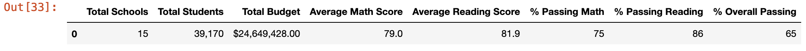
  - New District Summary:
  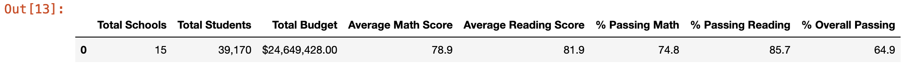
- How is the school summary affected?
  - The only school affected in the new analysis was Thomas High School
  - The average math score dropped by 0.067412
  - The average reading score increased by 0.047152
  - The percentage of students passing math dropped by 0.086581%
  - The percentage of students passing reading dropped by 0.29013%
  - The percentage of students passing both math and reading dropped by 0.317688%
  - Original School Summary:
  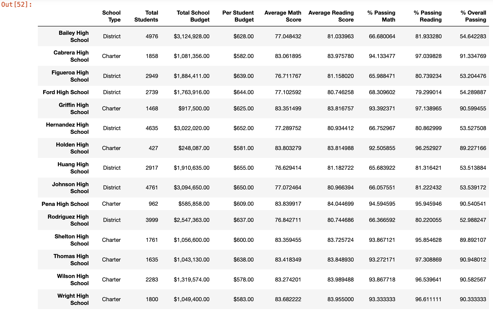
  - New School Summary:
  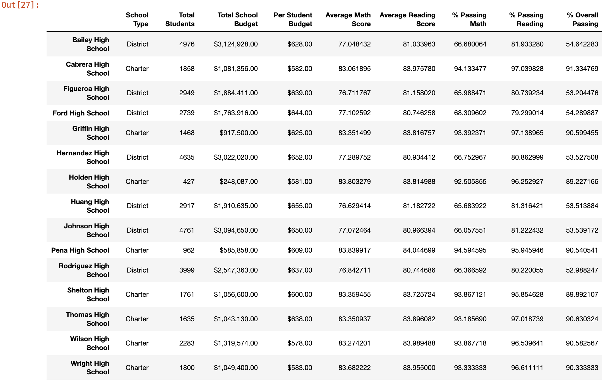
- How does replacing the ninth graders’ math and reading scores affect Thomas High School’s performance relative to the other schools?
  - Replacing the ninth graders' math and reading scores ultimately did little to affect Thomas High School's position as the number two school.
  - Original top schools' scores:
  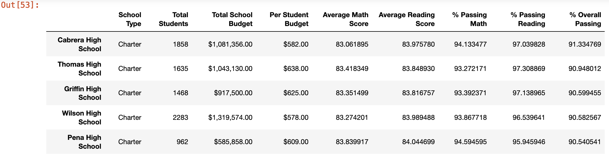
  - New top schools' scores:
  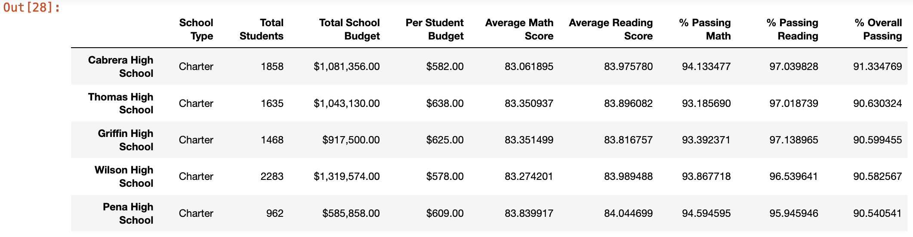
- How does replacing the ninth-grade scores affect the following:
  - Math and reading scores by grade
    - The only math scores affected are the ninth graders' math scores, which are now denoted with "NaN" instead of the original score of 83.6.
    - Original math scores by grade:
    
    - New math scores by grade:
    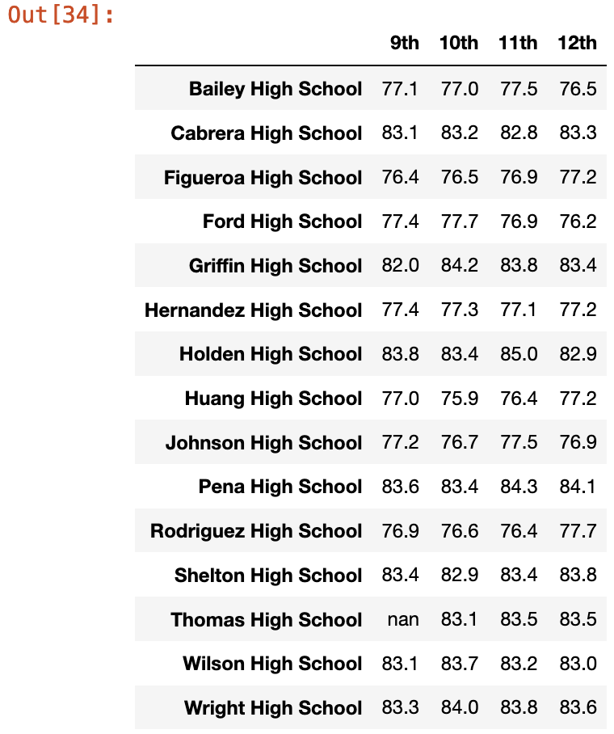
    - The only reading scores affected are the ninth graders' reading scores, which are now denoted with "NaN" instead of the original score of 83.7.
    - Original reading scores by grade:
    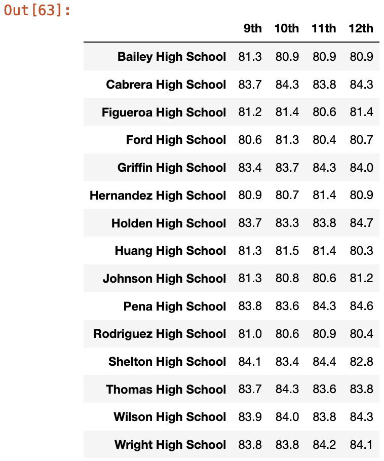
    - New reading scores by grade:
    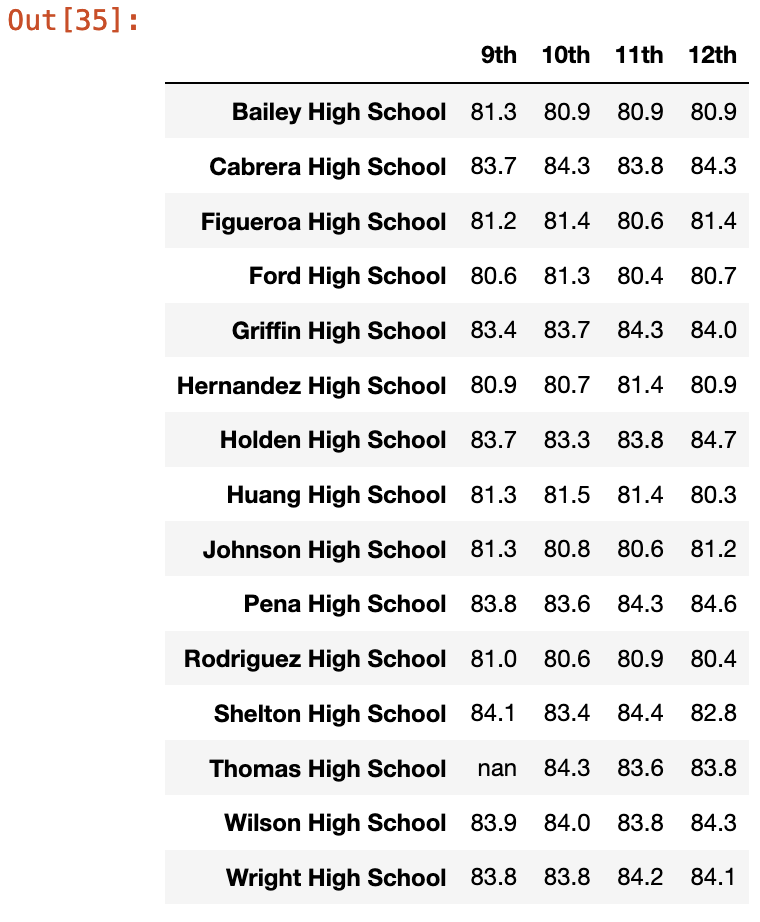
  - Scores by school spending
    - The average math and reading scores by spending were not affected.
    - Original scores by spending:
    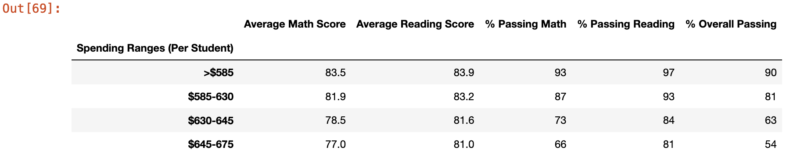
    - New scores by spending:
    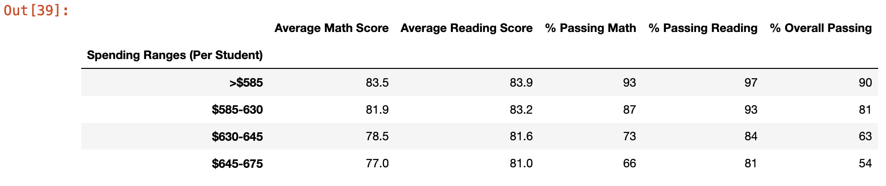
  - Scores by school size
    - The average math and reading scores by school size were not affected.
    - Original scores by size:
    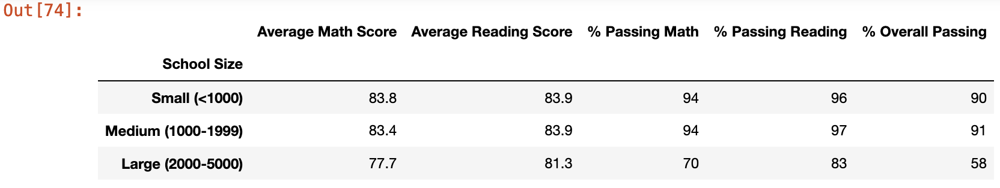
    - New scores by size:
    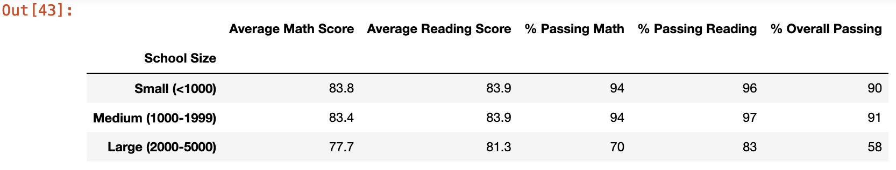
  - Scores by school type
    - The average math and reading scores by school type were not affected.
    - Original scores by type:
    
    - New Scores by type:
    
      

## Summary

In summary, when the ninth grade math and reading scores were taken out, Thomas High School's overall performance compared to rival schools stood strong due to solid grades from the upperclassmen. No scores or percentages for Thomas High School dropped by more than 0.32% and was able to retain the number two spot for top schools. Lastly, replacing the ninth graders' scores with no score ultimately did little to affect the school's overall performance by grade, spending, size, and type.
